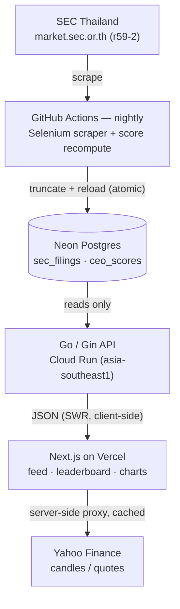

# SetQuant

Tracks insider trades filed with Thailand's SEC (r59-2 filings) and scores every
executive on what their own buying and selling actually returned, mark-to-market
against the current price.

**Live demo:** https://setquant.vercel.app
**Architecture one-pager:** [docs/architecture.html](docs/architecture.html)

## Architecture



The Go API only ever reads from Postgres. The only writer is the nightly GitHub
Actions job, which scrapes SEC Thailand and recomputes scores. The frontend fetches
filing/score JSON directly from the API and proxies stock candles from Yahoo Finance
through a Next.js API route (server-side, cached).

## Features

- **Live feed** — the latest insider filings across the SET50 universe, common
  shares only.
- **Insider leaderboard** — ranks executives by mark-to-market return on their own
  trades; a trade only counts if it clears a minimum size and the executive has
  enough of a track record (see Methodology below).
- **Candlestick charts** with trade markers overlaid at the actual filing dates.
- **Keyboard navigation** and mobile support across the feed and detail views.

## Scoring methodology

For each executive/symbol pair, qualifying buy and sell filings (transfers are
excluded) are aggregated into a volume-weighted average entry price (VWAP) over the
trailing year, then compared against the current spot price to produce a
mark-to-market return. An executive only appears on the leaderboard once they have
at least 2 qualifying trades and at least ฿100,000 in notional value; `combined_return_pct`
ranks the board.

This is intentionally a simplification: it compares a VWAP entry against a single
current price snapshot rather than tracking each lot individually or accounting for
realized exits, dividends, or splits. Treat the leaderboard as a relative signal
("this executive's insider trades have broadly worked out"), not a precise P&L.

## API

| Endpoint | Description |
|---|---|
| `GET /health` | Liveness check |
| `GET /api/v1/updates` | Latest 50 filings, ordered by trade date. Optional `?tier=TOP_50\|TOP_10` |
| `GET /api/v1/stock/:symbol` | All filings for a symbol |
| `GET /api/v1/scores` | Leaderboard, ordered by `combined_return_pct` |
| `GET /api/v1/scores/:symbol` | Scores for one symbol |
| `GET /api/v1/tweet/:symbol` | Pre-formatted tweet content for a symbol |
| `POST /api/internal/trigger-daily-tweet` | Fires the daily tweet job (requires `X-SetQuant-Secret`). The Twitter bot is built but intentionally not activated in production. |

## Running it locally

### Full stack (docker-compose)

```bash
cp .env.example .env
docker-compose up
```

Starts Postgres (`:5432`), the Go API (`:8080`), and the Next.js frontend (`:3000`)
with `NEXT_PUBLIC_API_URL` pointed at the local backend.

### Frontend only, no backend

```bash
cd frontend
npm install
npm run dev
```

With `NEXT_PUBLIC_API_URL` unset, the frontend falls back to bundled dummy data
(`frontend/lib/dummy-data.ts`) — useful for UI work without standing up Postgres or
running the scraper.

### Scraper

Needs Python 3.12 and a local Chrome install (Selenium 4's Selenium Manager
resolves the matching chromedriver automatically).

```bash
cd scraper
python -m venv venv && source venv/bin/activate
pip install -r requirements.txt

python main.py          # full scrape + bulk load (TRUNCATES sec_filings first)
python fetch_recent.py  # narrower scrape → latest_sec_data.csv
python ingest_csv.py    # load a CSV row-by-row without truncating
```

## Data pipeline

A GitHub Actions workflow (`.github/workflows/daily-pipeline.yml`) runs
`scraper/main.py` and `scraper/calculate_scores.py` daily at 14:00 UTC against the
production Neon database, and can also be triggered manually from the Actions tab.

**Known operational caveat:** SEC Thailand's WAF (F5) intermittently blocks GitHub
Actions runner IP ranges, so the scheduled scrape occasionally fails outright. The
pipeline is built to fail loudly rather than silently loading a partial dataset — if
the scrape is blocked, the job errors instead of truncating `sec_filings` with
incomplete data. The fallback when that happens is running the scraper from a
residential IP. (Separately: GitHub auto-disables scheduled workflows after 60 days
without a push to the repo, so an idle repo needs a manual re-enable.)

## Tech stack

Python (Selenium, pandas) for scraping · PostgreSQL (Neon) for storage · Go/Gin +
GORM (Cloud Run) for the API · Next.js 16 / React 19 / Tailwind v4 (Vercel) for the
frontend · GitHub Actions for the daily pipeline.
